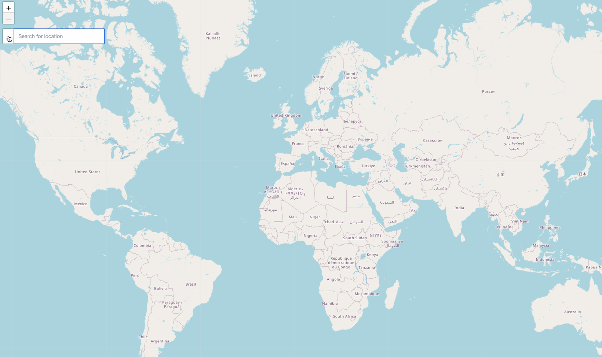
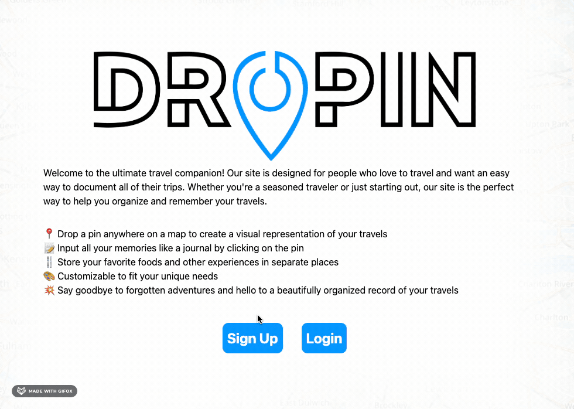
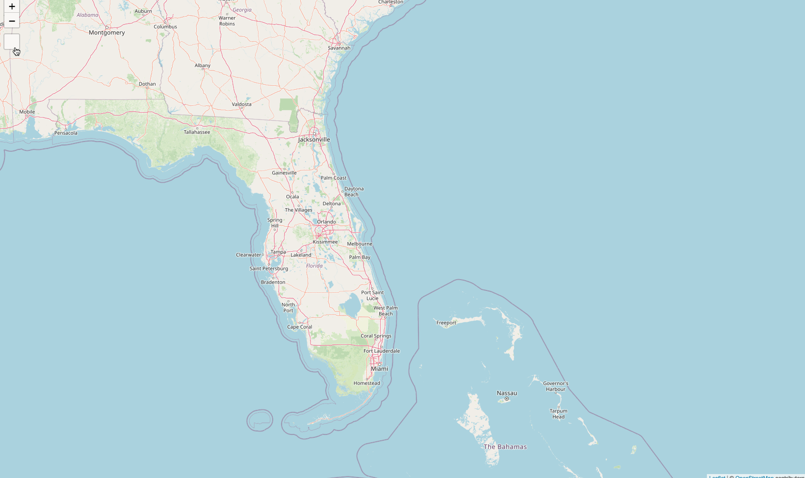
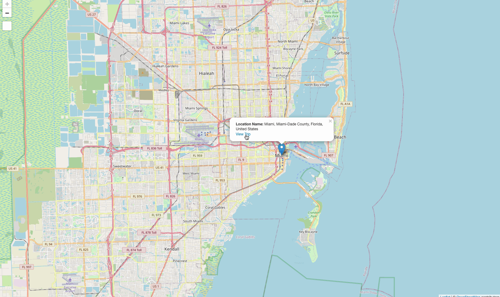
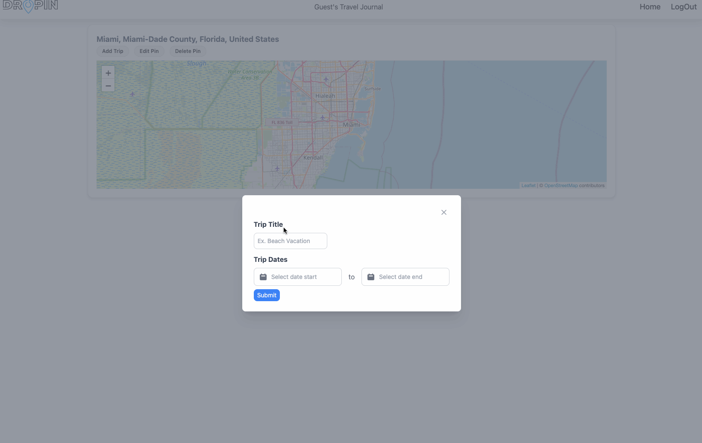
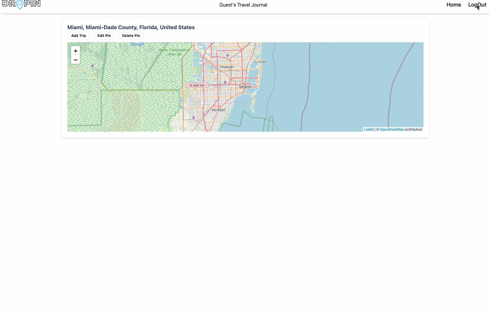
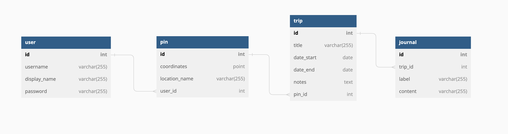
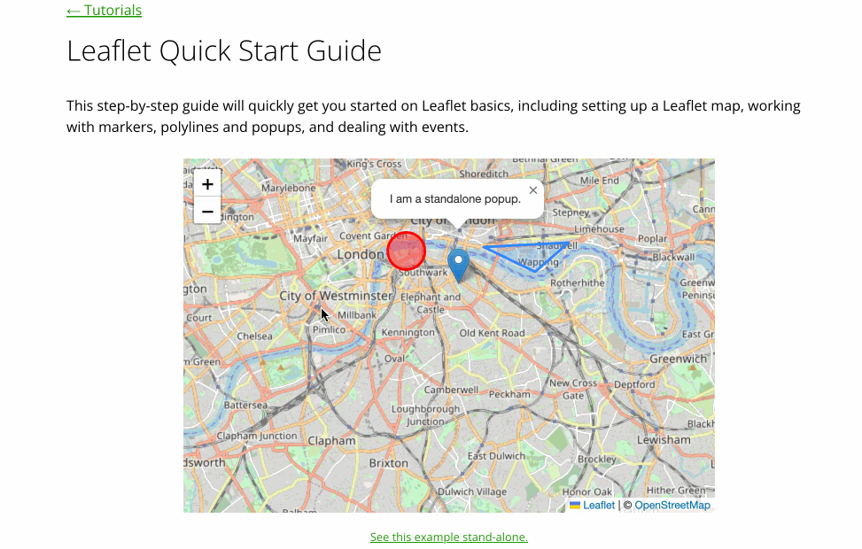
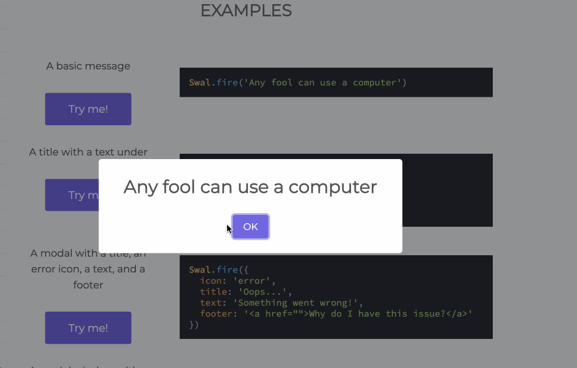

# DROPIN

## Table of Contents

* [Description](#description)
* [Technologies Used](#technologies-used)
* [User Stories](#user-stories)
* [Installation](#installation)
* [Usage](#usage)
* [Models and Routes](#models-and-routes)
* [New libraries/NPM Packages](#new-libraries/npm-packages)
* [Credits](#credits)
* [License](#license)

## Description 

We created this project because it is easy to forget the memories and specifics that happen on a trip. So we created a application that allows user to pick any place on a map and journal their experiences on the trip. We wanted to make sure the that users can have multiple different trips with journal entries and we solved that by letting each pin on the map contain link to that specific trip and journal information.

Try it here: [DROPIN](http://dropin.herokuapp.com) with the username: guest and password: Guest1234 .

## Technologies Used

- 
- 
- 
- 
- 
- 
- 
- 
- 
- 
- 
- 
- 

## User Stories 

1. As a user, I want a login/sign up form so that my personal data will be private and persist. 

This required two post routes to create a new user and to login an existing user. We also included a third route to verify if the username typed was avaialble. 

2. As a user, I want to be presented with an interactive map so that I can mark locations (with a pin) of places that I’ve visited.

3. As a user when I mark a new location, then I am presented with a form to enter details about my trip so that I can organize and store trip information I want to remember.

4. As a user when I click one of my pins, I am presented with a separate page with my trip details so that I can reflect and remember my experiences.

5. As a user when I am viewing a specific trip’s details I am presented with buttons so that I can add/update/delete my experiences/notes.

6. As a user when I am done using the site, I have the option to log out so that  I can keep my personal data safe

## Installation

Steps:
1. Click the link
2. Once landed on home page if you haven't signed up then click signup and enter information needed.
3. If you have signed up the login with user information.
4. You will land on a dashboard page and you can start adding pins to begin you journey.

## Usage 

Steps:
1. Now that you are in the page and started creating pin you can get to the trip information by clicking pin and clicking on the "View Journal" link.
2. Now that you're in journal you can add a trip and details on the trip.
3. You can edit the pin name, trip, trip details, and notes.
4. Also you can delete the pin, trips, trip details, and notes all on the same page.
5. Nav bar is used to direct you home which is the dashboard or log out when you feel it is necessary.

## Models and Routes

Below is an ERD of our database schema and table relationships. We used MySQL for our database and Sequelize for our ORM.

Below is a list of our API routes and their corresponding controller methods.

| Route | HTTP Verb | Description |
| ----- | --------- | ----------- |
| `/api/users` | `GET` | Get all users |
| `/api/users` | `POST` | Create a new user |
| `/api/users/:id` | `GET` | Get a user by id |
| `/api/users/:id` | `PUT` | Update a user by id |
| `/api/pins` | `GET` | Get all pins |
| `/api/pins` | `POST` | Create a new pin |
| `/api/pins/:id` | `GET` | Get a pin by id |
| `/api/pins/:id` | `PUT` | Update a pin by id |
| `/api/pins/:id` | `DELETE` | Delete a pin by id |
| `/api/trips` | `GET` | Get all trips |
| `/api/trips` | `POST` | Create a new trip |
| `/api/trips/:id` | `GET` | Get a trip by id |
| `/api/trips/:id` | `PUT` | Update a trip by id |
| `/api/trips/:id` | `DELETE` | Delete a trip by id |
| `/api/journals` | `GET` | Get all trip journals |
| `/api/journals` | `POST` | Create a new trip journal |
| `/api/journals/:id` | `GET` | Get a trip journal by id |
| `/api/journals/:id` | `PUT` | Update a trip journal by id |
| `/api/journals/:id` | `DELETE` | Delete a trip journal by id |

## New libraries/NPM Packages

[Leaflet](https://leafletjs.com/) - Leaflet is the leading open-source JavaScript library for mobile-friendly interactive maps. We use it to load a map on our page and allow users to drop pins on the map.

[SweetAlert](https://sweetalert2.github.io/) - A beautiful, responsive, customizable, and accessible replacement for JavaScript's popup boxes. Zero dependencies.

## Tailwinds CSS

Tailwinds CSS is a open source framework that allows the user full freedom to customize the page. This framework is nice because it  makes styling the page more user friendly compared to the typical CSS stylesheet. 

## Different Page Sizes

1. Login sizes

2. Dashboard sizes

3. Trip page Sizes

## Learning Objectives

Some learning curves we had was working with tailwinds caused some transitioning issues but once the we referred to the correct docs we seen the npm package was different from the the CDM. Another learning curve was using Leaflet with handlebars, we had difficulties implementing the correct script but once we notice the syntax error we were able to smoothly work through our js file for the map.

## Authors Contact Information

1. Travis DuPree:
  * [Github](https://github.com/Traveye)
  * [LinkedIn](https://www.linkedin.com/in/travis-dupree-96380218b/)
2. McCoy Didericksen:
  * [Github](https://github.com/mccoydidericksen)
  * [LinkedIn](https://www.linkedin.com/in/mccoydid/)
3. Jonathan Pohahau:
  * [Github](https://github.com/j-pohahau5) 
  * [LinkedIn](https://www.linkedin.com/in/jonathan-pohahau/)

## Credits

- [Tailwinds](https://tailwindcss.com/)
- [Leaflet](https://leafletjs.com/)
- [Sweet Alert](https://sweetalert2.github.io/)
- [Cloudflare](https://www.cloudflare.com/)
- [W3Schools](https://www.w3schools.com/)
- [Mozilla](https://developer.mozilla.org/en-US/)
- [Bootstrap](https://getbootstrap.com/)
- [MIT](https://choosealicense.com/licenses/mit/)

## License

MIT License

Copyright (c) [2023] [DROPIN]

Permission is hereby granted, free of charge, to any person obtaining a copy
of this software and associated documentation files (the "Software"), to deal
in the Software without restriction, including without limitation the rights
to use, copy, modify, merge, publish, distribute, sublicense, and/or sell
copies of the Software, and to permit persons to whom the Software is
furnished to do so, subject to the following conditions:

The above copyright notice and this permission notice shall be included in all
copies or substantial portions of the Software.

THE SOFTWARE IS PROVIDED "AS IS", WITHOUT WARRANTY OF ANY KIND, EXPRESS OR
IMPLIED, INCLUDING BUT NOT LIMITED TO THE WARRANTIES OF MERCHANTABILITY,
FITNESS FOR A PARTICULAR PURPOSE AND NONINFRINGEMENT. IN NO EVENT SHALL THE
AUTHORS OR COPYRIGHT HOLDERS BE LIABLE FOR ANY CLAIM, DAMAGES OR OTHER
LIABILITY, WHETHER IN AN ACTION OF CONTRACT, TORT OR OTHERWISE, ARISING FROM,
OUT OF OR IN CONNECTION WITH THE SOFTWARE OR THE USE OR OTHER DEALINGS IN THE
SOFTWARE.

