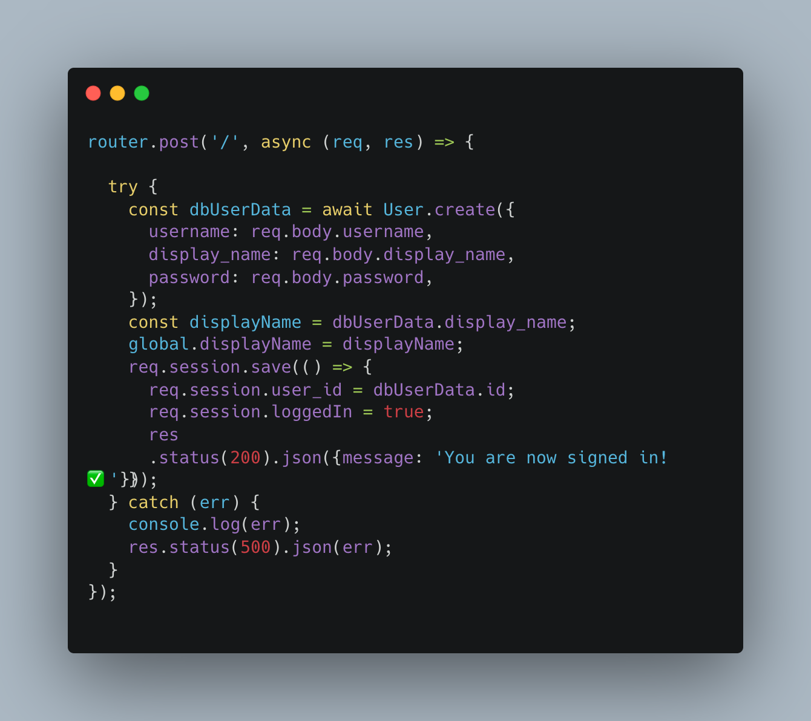
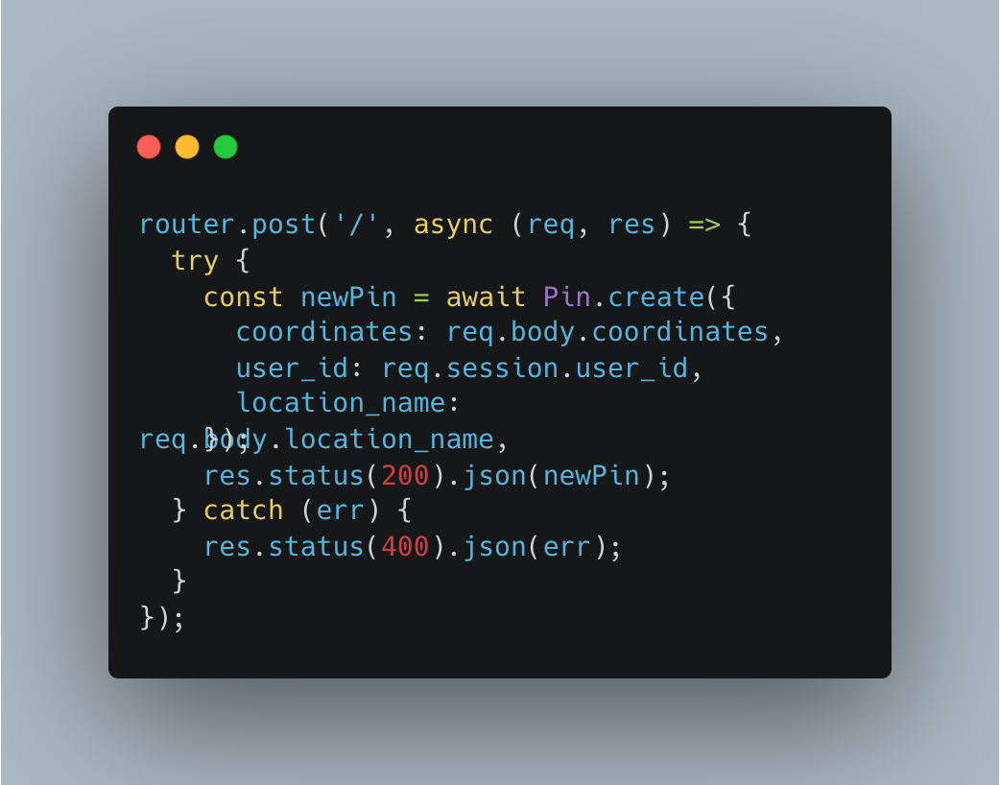
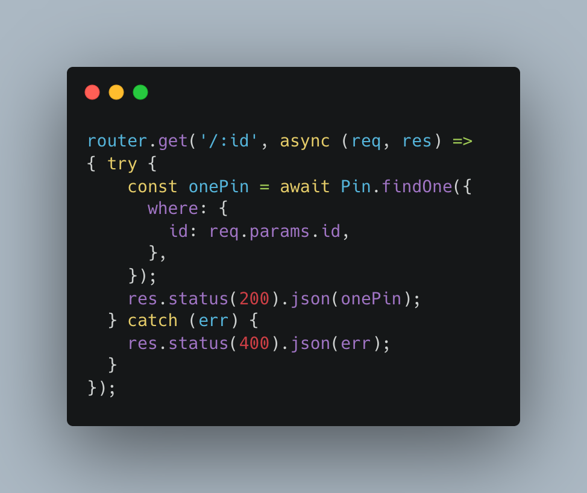
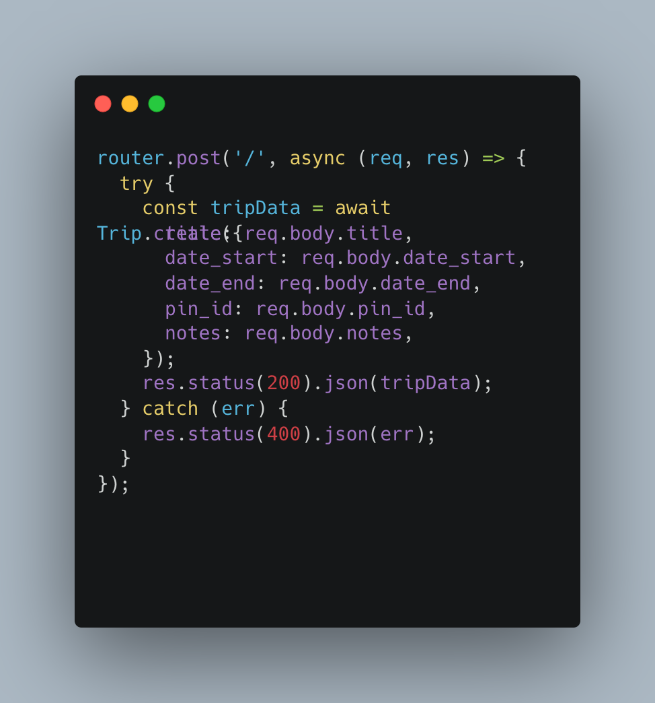
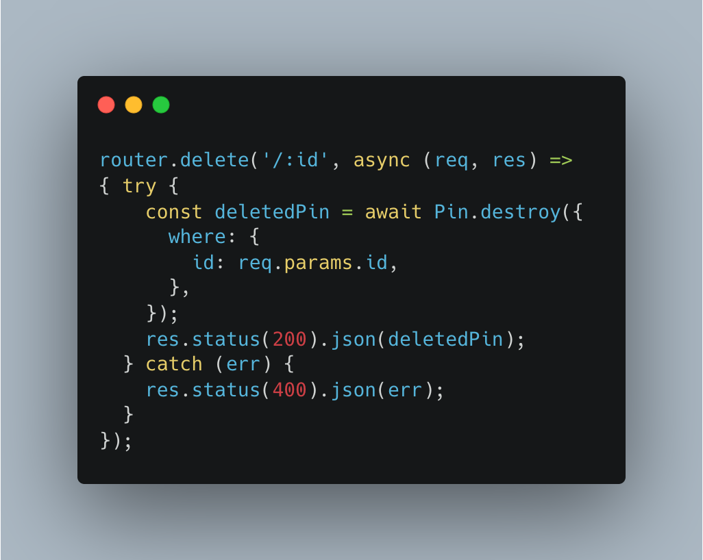

# DROPIN

## Description 

We created this project because it is easy to forget the memories and specifics that happen on a trip. So we created a application that allows user to pick any place on a map and journal their experiences on the trip. After signing in you can click the map to drop a pin or search for a specific location to create a new pin. Then you will be able to open a new trip journal from the pin and enter in all of your memories.

App Link: [DROPIN](http://dropin.herokuapp.com)

## Table of Contents

* [Installation](#installation)
* [Usage](#usage)
* [Credits](#credits)
* [License](#license)
* [Badges](#badges)

## Installation

Steps:
1. Click the link
2. Once landed on home page if you haven't signed up then click signup and enter information needed.

3. If you have signed up the login with user information.
4. You will land on a dashboard page and you can start adding pins to begin you journey.

## Usage 

Steps:
1. Now that you are in the page and started creating pin you can get to the trip information by clicking pin and clicking on the "View Journal" link.

2. Now that you're in journal you can add a trip and details on the trip.

3. You can edit the pin name, trip, trip details, and notes.

4. Also you can delete the pin, trips, trip details, and notes all on the same page.

5. Nav bar is used to direct you home which is the dashboard or log out when you feel it is necessary.

## Credits

Tracis Dupree
https://github.com/Traveye
McCoy Didericksen
https://github.com/mccoydidericksen
Jonathan Pohahau
https://github.com/j-pohahau5 
https://tailwindcss.com/
https://leafletjs.com/
https://sweetalert2.github.io/
https://www.cloudflare.com/
https://www.w3schools.com/
https://developer.mozilla.org/en-US/
https://getbootstrap.com/
https://choosealicense.com/licenses/mit/

## License

MIT License

Copyright (c) [2023] [DROPIN]

Permission is hereby granted, free of charge, to any person obtaining a copy
of this software and associated documentation files (the "Software"), to deal
in the Software without restriction, including without limitation the rights
to use, copy, modify, merge, publish, distribute, sublicense, and/or sell
copies of the Software, and to permit persons to whom the Software is
furnished to do so, subject to the following conditions:

The above copyright notice and this permission notice shall be included in all
copies or substantial portions of the Software.

THE SOFTWARE IS PROVIDED "AS IS", WITHOUT WARRANTY OF ANY KIND, EXPRESS OR
IMPLIED, INCLUDING BUT NOT LIMITED TO THE WARRANTIES OF MERCHANTABILITY,
FITNESS FOR A PARTICULAR PURPOSE AND NONINFRINGEMENT. IN NO EVENT SHALL THE
AUTHORS OR COPYRIGHT HOLDERS BE LIABLE FOR ANY CLAIM, DAMAGES OR OTHER
LIABILITY, WHETHER IN AN ACTION OF CONTRACT, TORT OR OTHERWISE, ARISING FROM,
OUT OF OR IN CONNECTION WITH THE SOFTWARE OR THE USE OR OTHER DEALINGS IN THE
SOFTWARE.

## Badges

 

